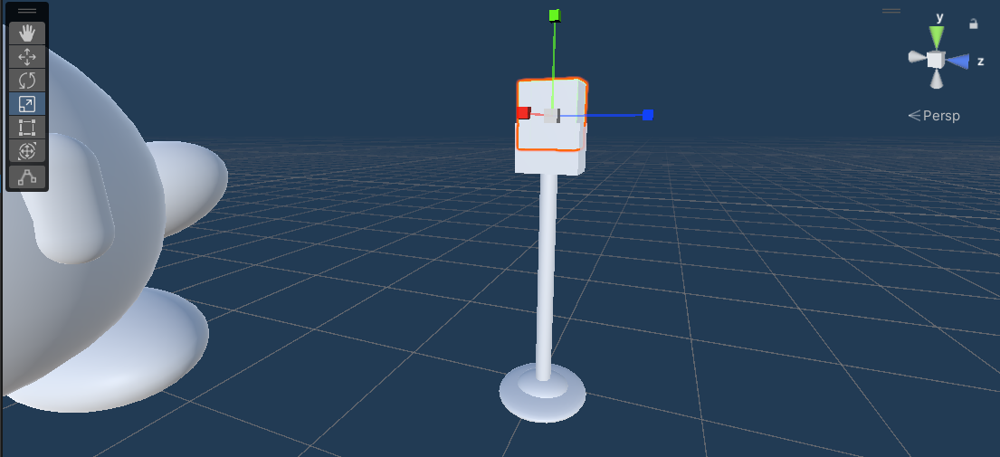

# Challenge 02 - Kirby

## Integrantes del equipo
- Debbimar Díaz Santiago
- Jonlier Díaz Rivera
- Jeremy Curry Romero

## Reglas del reto
Hacer un prefab de Kirby y 4 variantes (4 kirbys diferentes). Crear un terreno y intepretar un area de Puerto Rico.

---

## Proceso

### Kirby Prefab

  
  
<i>iniciando con el prefab.</i>

Lo primero que se hizo fue ir a objetos 3D y seleccionar la esfera para hacer el cuerpo de kirby y luego volvimos a seleccionar en la area de objetos pero esta vez son dos capsulas y estas se modifican de tamano, con la herramienta de escala se hacen mas pequenas y luego con la herramienta de mover se colocan enfrente de la esfera (cuerpo) y con esto se hicieron los ojos. Una vez esos primeros pasos se arrastra ese objeto a la area de assets para crear un prefab. 

### Rigidbody

  
  
<i>Se agrega el rigidbody.</i>

En el prefab en la opcion de de agregar componentes, se selecciona y se busca la opcion de rigidbody y la agregamos.

### Variants

  
  
<i>Se crean 4 variantes del prefab</i>

Despues de haber creado el prefab se hacen 4 variantes para los diferentes kirbys y esto se hace arrastrando el prefab principal al area de assets y unity te da un aviso de si quieres crear un prefab variants y al marcar que si ya tenemos el primer variant. Se hacen los mismos pasos para el resto de los variants.

### Kirby Normal Prefab Variant 1

### Kirby Mike Prefab Variant 2 

  
  
<i>Microfono</i>

Para el segundo kirby en este caso la version de Mike, en el cual es un kirby con microfono y audifonos. Lo que se hizo para este kirby fue acomodar los brazos y los pies con la herramienta de mover y rotar. Aqui lo principal era crear el microfono, para este se fue a la area de objetos y se escogio un cilindro y con la opcion de escala se minimizo para que fuera el tamano correcto para nuestro kirby. Luego con una esfera y la herramienta de escala como que la aplastamos para hacer una especie de plato hondo y luego duplicamos eso y con la herramienta de escala se agranda un poco para que quede mas redondo y hacer la base del microfono con  mas detalle. Por ultimo con un cubo, se uso la herramienta de escala para ponerlo mas pequeno y luego hacer la base de arriba del microfono y ese cubo se duplico para hacer algo similar que se hizo para la base del tubo y luego de que tenemos el cubo ya pues se edita la escala para hacerlo un poco mas pequeno y que quede el microfono dentro de la base del microfono y con la herramienta de mover se coloca arriba del cilindro y base que en cojunto hacian el agarre del microfono.

  
  
<i>Posicionamiento de microfono.</i>

Aqui con la herramienta de mover y rotar se coloco el microfono en la mano de kirby.

  
  
<i>Kirby Mike terminado.</i>

Finalmente se hicieron los audifonos, primero con algo similar que se hizo la base de el agarre del microfono pues se hicieron las almoadillas de los audifonos. Con una esfera que se aplasto y otra que quedo mas redonda se hizo una almoadilla y luego se duplico para colocarla una en cada lado del cuerpo de kirby. Por ultimo se utilizaron 3 cilindros para hacer el "casco" osea lo que conecta las almoadillas y crea el auricular. Con la herramienta de escala se puso el cilindro mas pequeno y se coloco en la parte de arriba del cuerpo de kirby y se duplico ese cilindro y se puso aun mas pequeno y con la herramienta de rotar y movier se coloco uno en cada lado conectando las almoadillas y completando el audifono.

### Kirby Sword Prefab Variant 3

  
  
<i>Cejas.</i>

Para la variante 3, Kirby Sword en este caso. Lo primero que se hizo fue agregar una esfera de objetos y con la herramienta de escala se hicieron mas pequenas y se estiro para hacer una especie de ceja, luego con la herramienta de rotar y mover se colocaron sobre los ojos y asi lograr la expresion mas ruda del kirby.

  
  
<i>Mango de la espada.</i>

La cosa mas importante para lograr este kirby es la espada, para esto primero se agrego un cilindro y se hizo mas o menos mas ancho que el de el microfono y con la herramienta de escala fue que se minimizo un poco. Luego se agrego otro cilindro el cual con la herramienta de escala se aplasto bastante para el diseno del mango, con una esfera la cual se edito y se puso mas pequena con la escala pues se coloca en el centro del diseno arriba del agarre y se duplico para colocarlo en ambos lados de la espada y quedara el mango asi. Para el resto de la espada, especificamente para el filo y la espada como tal se utilizo un bloque y con la opcion de escala se alargo y coloco encima del mango, despues con dos cubos pequenos se coloco la punta de la espada osea se creo el efeccto de diamante o filo en la espada. Con la rotacion y lo de mover se coloco la espada en la mano del kirby. Para este kirby los pies y brazos se movieron y rotaron de posicion para poder recrear la pose de la imagen. Una vez la espada en su sitio, con una esfera y la opcion de escala se aplasto para hacer la base del gorrito. Despues con otra esfera la cual se alargo para recrear el gorro como tal y se coloco encima del kirby y posiciono para que pareciera el gorro mas o menos caido. Por ultimo con una esfera que se minimizo se hizo la punta del gorro.

  
  
<i>Kirby Sword terminado.</i>

### Kirby Ness Prefab Variant 4

foto
Parte 1 (Prefab)

Para hacer a Kirby Ness, primero utilicé el Kirby Simple como prefab y creé una variante de este.
foto
Parte 2 (Corona de la gorra)

Luego de haber creado el prefab, utilizamos una esfera para crear la corona de la gorra (la parte superior).
Aplastamos ligeramente la esfera para que quedara un poco plana y la agrandamos de modo que sobresaliera de la cabeza de Kirby, simulando así la gorra.
Esta parte tomó algo de trabajo, ya que fue un reto lograr que la parte superior se viera circular y, al mismo tiempo, que los lados se vieran planos para que pareciera una gorra real.
foto
Parte 3 (Visera de la gorra)

Al terminar la corona, comenzamos a crear la visera de la gorra.
Para esto utilizamos otra esfera, la reduje bastante de tamaño y la aplanamos de forma pronunciada para que quedara bien plana en la parte inferior.
Luego estiramos un poco la parte superior para darle la curva característica de la visera.
Por último, la colocamos en la parte frontal de la cabeza de Kirby.
foto
Parte 4 (Botón de la gorra)

Después de terminar la visera, creamos el botón superior de la gorra.
Simplemente utilizamos una esfera y la redujimos bastante para que quedara como una pequeña bolita.
Cuando el tamaño pareció adecuado, la colocamos en la punta superior de la gorra.
foto
Parte 5 (Colorear)

Una vez colocadas todas las partes de la gorra de Kirby, comencé a colorearlas.
Para esto, en la parte inferior de Unity creé materiales.
Para cada color, en el Base Map seleccioné el tono correspondiente y luego arrastré el material sobre cada objeto que quería pintar.

foto extra

### Terrain

  
  
<i>Kirby Mike en Terrain.</i>

  
  
<i>Kirby Sword en Terrain.</i>

### Memoria o Historia
Debbimar (Memoria) - Cuando era pequeña cuando estaban de moda los Nintendo DS yo tenía uno y un juego que jugaba bastante era sino mal recuerdo Kirby Súper Star Ultra. Lo jugaba mucho juntos al resto de juegos de la franquicia de Nintendo. Pero Kirby específicamente es un juego que me marcó bastante y de los que más recuerdo, junto a Starfy que era similar y yoshi island. Hace mucho no juego ninguno de Kirby ya que no sentía el mismo “hype” a los antiguos que habían de plataforma en DS. Esos juegos tenían ese toque que sin importar que no te aburrías. Actualmente me ha llamado la atención el juego más reciente que han sacado de Kirby in The Forgotten Land que es parecido al Mario Odissey en cuestión del mundo abierto y se ve interesante pero aún no me he tomado la oportunidad de comprármelo.

### Esperiencia Ganada
Debbimar - De este challenge lo que mas me sorprendio fue la cantidad de veces que utilice esferas. Al kirby ser un personaje redondo y casi todas sus extremidades ser de la misma forma pues muchas cosas eran con esferas pero en otros kirbys se utilizaron tambien cubos, cilindros e incluso capsulas. Me sorprendio como con objetos 3D simples se logro hacer "objetos" o assets mas complejos como el microfono y la espada.
